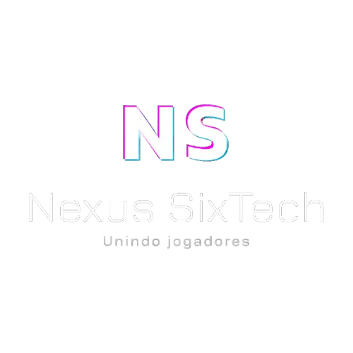

# 
<table border="0">
  <tr>
    <td>
      
    </td>
    <td>
      <h2 align="center">Bem-vindo ao <strong>Nexus SixTech</strong></h2>
      <h3>
        Um projeto de site de vendas e cadastro de jogos digitais.<br>
        O objetivo é construir uma plataforma responsiva, moderna e funcional, que permita o 
        <strong>cadastro de usuários, administração de produtos e gerenciamento de vendas</strong>.
      </h3>
    </td>
  </tr>
</table>

---

## 🚀 Objetivo do Projeto
Criar um **site responsivo** para **desktop, tablets e smartphones**, que ofereça:
- Tela de cadastro e login de usuários
- Painel administrativo para gerenciar usuários e produtos
- Cadastro, listagem e edição de jogos
- Sistema de compra/venda de jogos
- Interface simples, responsiva e intuitiva

---

## 🛠️ Tecnologias Planejadas
O projeto será desenvolvido utilizando:

- **HTML5** → estrutura do site  
- **CSS3** → estilização e design  
- **Bootstrap 5** → responsividade e componentes prontos  
- **JavaScript (ES6+)** → interatividade no front-end  
- **PHP** → backend e regras de negócio  
- **MySQL** → banco de dados para usuários e produtos  

---

## 📌 Funcionalidades Planejadas
### 👤 Usuários
- Criar conta e fazer login
- Editar perfil
- Listar e visualizar jogos cadastrados
- Comprar jogos (futuro)

### 🛠️ Administradores
- Acessar painel administrativo
- Cadastrar novos jogos
- Gerenciar usuários
- Editar e remover produtos

---

## 🎯 Estrutura Inicial do Projeto
```
/Nexus_SixTech
    ├── cadastro # Pagina HTML
    │   └── Cadastro.html
    │
    ├── css # Todos os arquivos CSS
    │   └── cadastro.css
    │
    ├── img # Imagens como logo do projeto
    │
    ├── js # Todos os arquivos JS
    │   └── validacoes.js
    │
    ├── assets # Páginas, documentos e arquivos adicionais
    ├── LICENSE
    └── README.md

```

---

## 📅 Status do Projeto
🚧 **Em Prática** – Desenvolvimento iniciado.

---

## 🤝 Contribuição
Contribuições serão bem-vindas assim que o projeto estiver em andamento.  
Sugestões de novas funcionalidades, melhorias de código e design são encorajadas!  

1. Faça um **fork** do repositório  
2. Crie uma **branch** com sua feature (`git checkout -b minha-feature`)  
3. Faça o **commit** (`git commit -m 'Adiciona minha feature'`)  
4. Faça o **push** (`git push origin minha-feature`)  
5. Abra um **Pull Request**

---

## 📄 Licença
Este projeto será desenvolvido como **open source** sob a licença MIT.  
Sinta-se livre para usar, modificar e compartilhar.

---

## 👨‍💻 Autor
Projeto idealizado por **Nexus SixTech**.

Integrantes da **Nexus SixTech**:
[Yago](https://github.com/tenmenezes) | 
[Yasmim](https://github.com/YasmimMantovani) | 
[Thiago](https://github.com/Thiago-Rock) | 
[Fred](https://github.com/FredWallace) | 
[Carlos](https://github.com/ClaudinoGomes) | 
[Bruno](https://github.com/Bruno-Washington).

Desenvolvido inicialmente como estudo prático em **HTML, CSS, JS, PHP e MySQL**.

